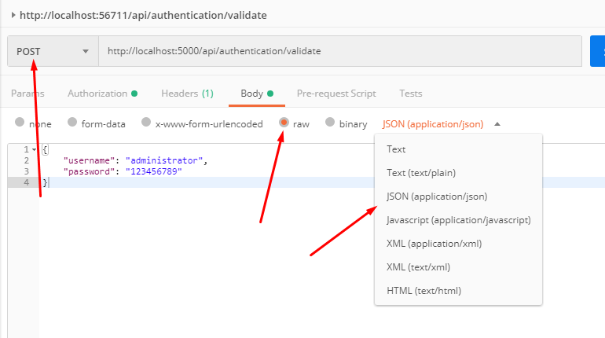
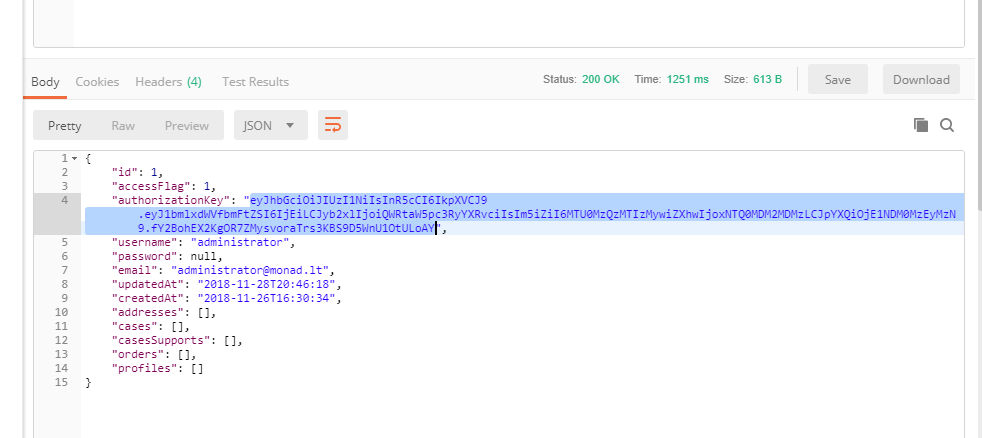
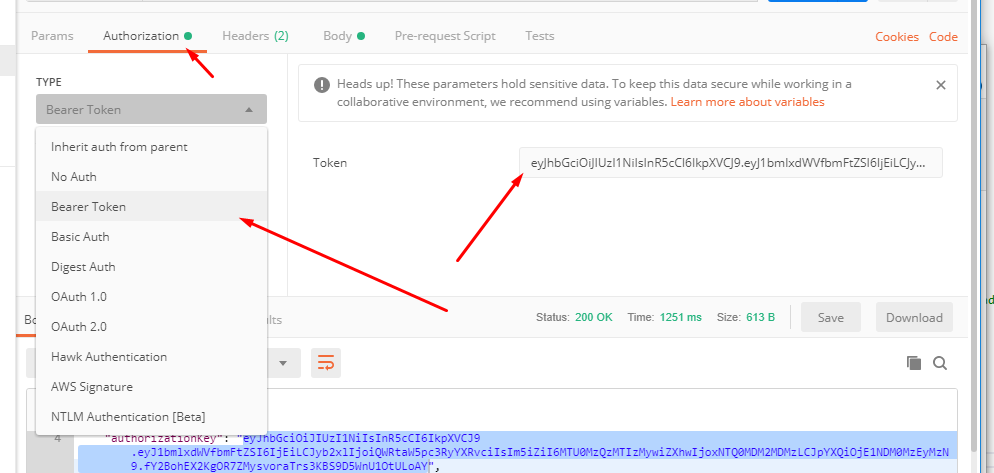

API plėtojimas

Visų pirma, kad išvengti problemų, nuklonavus repositorija sukuriamas naujas „branch“. Kaip tai padaryti rasite čia.

https://github.com/Kunena/Kunena-Forum/wiki/Create-a-new-branch-with-git-and-manage-branches

Kiekvienas žmogus susikuria savo atsikrą repositorijos atšaką ir į ją kelia kodo pakeitimus.

#### Duombazės nustatymai

Naudojant WAMP arba XAMPP reikia žinoti prisijungimus prie MySQL phpMyAdmin. Ir juos suvesti į `appsettings.json`.

```json
"ConnectionStrings": {
	"DefaultConnection": "server=localhost;userid=root;password=;database=bookstore;"
}		
```

Importuoti duombazės schemą galima iš repositorijos `database/revisions` ir pasirinkti patį naujausią failą. 

#### DTO naudojimas

„Pliki“ Entity Framework modeliai esantys `Models` direktorijoje kartais gali parodyti ko rodyti nereiktų arba tiesiog kelti problemų serializuojant (gaunasi nesibaigiantis serializavimo ciklas), todėl yra naudojami DTO modeliai `Models/DTOs`. Turbūt jau visi reikiami DTO modeliai yra sugeneruoti, o kaip juos konvertuoti iš Entity Framework modelio galima pamatyti čia:

```c#
public IQueryable<ClientDTO> FetchClientData()
{
	return _context.Clients.Select(client => _mapper.Map<ClientDTO>(client));
}
```

Plačiau: Controllers/API/Privileged/PrivilegedClientController.cs

#### Klaidų gražinimas

Kaskart aptikus klaidą (dėl nerasto objekto ar dėl neteisingų duomenų) grąžinamas `BadRequest` kartu su anonimišku objektu turinčių `message` lauką.

```c#
if (modified.Id != clientId)
	return BadRequest(new { message = "Blogai pateikti kliento duomenys." });
```

Būtų gerai, kad visur išliktu vienodas klaidos grąžinimo objektas, nes tada paprasčiau apdoroti klaidas front-end.

#### Pavyzdžiai

Pagrindinis pavyzdys su detaliu aprašymu yra Controllers/API/Privileged/PrivilegedClientController.cs

#### API išbandymas

API išbandymui turbūt patogiausia naudoti [Postman](https://www.getpostman.com/). Kiekvienai užklausai įvykdyti reikalinga konfigūriacija:

1. Iš pradžių reikia gauti autorizacijos raktą.
   POST metodu siunčiama užklausa į http://localhost:5000/api/authentication/validate



2. Gaunamas atsakas. Pasirenkamas `authorizationKey` ir nukopijuojamas.
   

3. Ir toliau kitose užklausose `Authorization` meniu pasirenkamas `Bearer Token` ir įklijuojamas `authorizationKey`.

   

4. Toliau galima vykdyti visas reikiamas užklausas kur yra autorizacijos reikalavimas.


